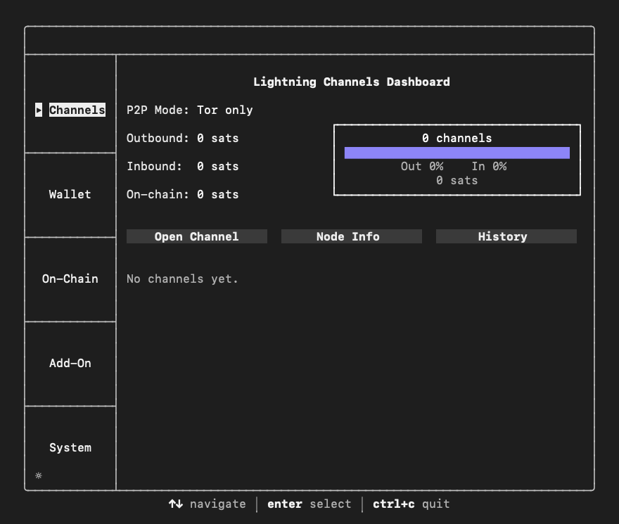
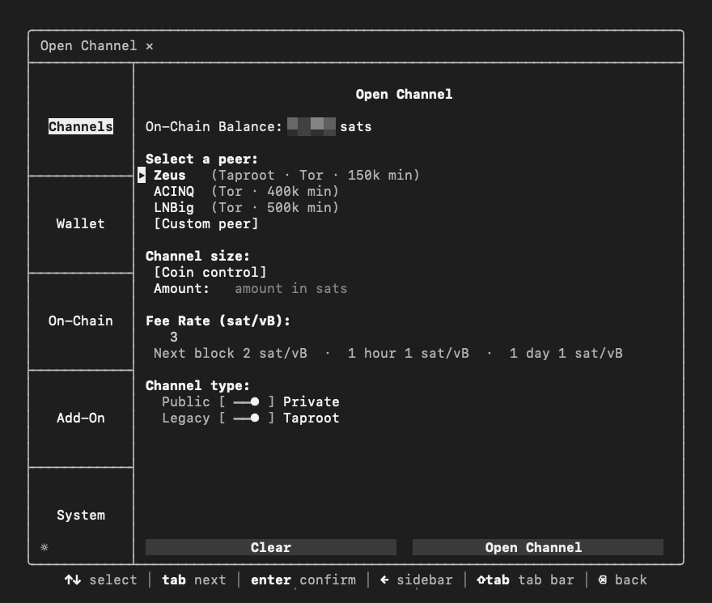
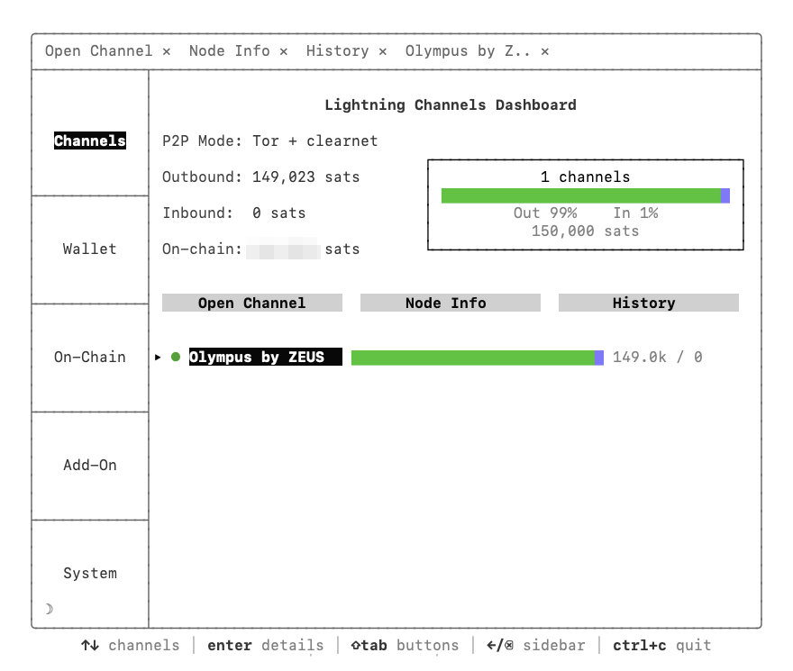
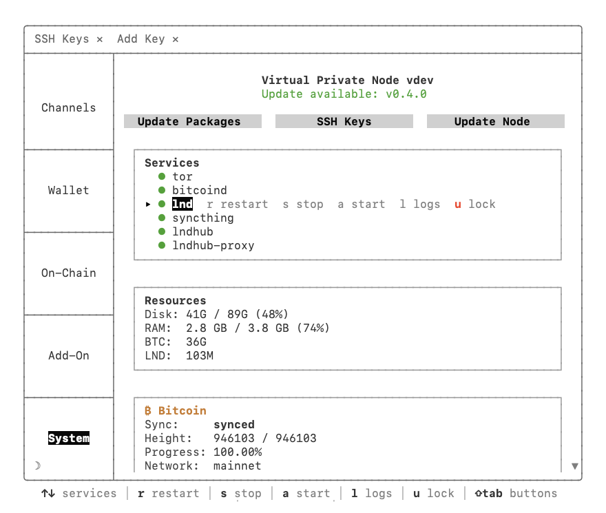

# Virtual Private Node

A one-command installer for a Bitcoin + Lightning node on Debian.
Bitcoin Core, LND, and Tor, configured and running in minutes.

After installation, manage your node with the beautiful TUI
or `bitcoin-cli`, `lncli`, and `systemctl`.
Private by default, simple by design. Your keys, your node.

## Screenshots

<p>
  
  
</p>
<p>
  
  
</p>

## What gets installed

### Base (automatic)

- **Bitcoin Core** — pruned node, all P2P through Tor, GPG-verified with 5 independent signatures
- **LND** — Lightning Network daemon with Tor hidden services, installed Tor-only by default
- **Tor** — all traffic routed through Tor by default
- **UFW firewall** — deny all incoming except SSH
- **fail2ban** — brute force protection
- **Unattended upgrades** — automatic Debian security updates
- **NTP clock sync** — accurate time for block timestamps, HTLC timeouts, and macaroon expiry

### Optional (from the TUI)

- **Syncthing** — automatic LND channel backup to your local device

### Requirements

- Fresh Debian 13+ Box
- 2 (v)CPU, 4+ GB RAM, 90+ GB SSD

### Privacy

- **Private channels by default.** Channel funding transactions are not linked to your node in the public graph. SCID alias hides the real channel ID from route hints when supported by the channel peer. Blinded paths (default on) go further by eliminating route hints entirely.
- **Blinded paths on invoices (default on).** Invoices use encrypted route data instead of plain hop hints. Senders can pay you without learning your node's pubkey, channel partners, or channel funding UTXOs.
- **Coin control for channel opens.** You choose which UTXOs fund each channel. One UTXO in, one channel out. No silent coin consolidation linking your channels on-chain.
- **Taproot channels (default on).** Cooperative channel closes produce a MuSig2 key-path spend, which looks identical to a regular single-sig transaction on-chain. Requires peer support.
- **Consistent P2TR address type.** All addresses (receive, change, close delivery, sweep) use the same bc1p format. P2TR has a smaller anonymity set than P2WPKH today, but matching LND's internal address type prevents change-detection fingerprints that would link your outputs regardless of anonymity set size.
- **No node alias.** Your node appears in the network graph with only its pubkey. No identifying name broadcast.
- **Tor-only by default.** All LND connections route through Tor hidden services. Your server IP is never published to the Lightning Network unless you explicitly upgrade to hybrid P2P mode.

### Quick Start

SSH into your Server (Box) and run:

```bash
curl -sL https://raw.githubusercontent.com/ripsline/virtual-private-node/main/virtual-private-node.sh | sudo bash
```

> [!NOTE]
> Some downloads route through Tor and can occasionally fail on the first attempt. The script is idempotent and safe to rerun. If you hit an error, just run the above command again.

This creates a `ripsline` user, copies your SSH key across automatically,
downloads the `rlvpn` binary, installs Bitcoin Core + LND + Tor, and
hardens the SSH daemon. Follow the on-screen instructions to SSH in as
`ripsline` — Bitcoin Core begins syncing and the TUI opens to the wallet
creation flow.

For testnet4:

```bash
curl -sL https://raw.githubusercontent.com/ripsline/virtual-private-node/main/virtual-private-node.sh | sudo bash -s -- --testnet4
```

**SSH key discovery.** The bootstrap tries several ways to find an
existing SSH key to copy to the new `ripsline` user: `$SUDO_USER`'s
`authorized_keys`, then `logname`, then `who`, then `/root/.ssh/`.
This works for `curl | sudo bash`, `sudo su -` followed by curl, and
bare-metal root installs. If no key is found, a random password is
printed at the end and you can add a key later from the TUI.

### Build from Source

```bash
sudo apt update && sudo apt install -y git wget sudo curl

cd /tmp
wget https://go.dev/dl/go1.26.1.linux-amd64.tar.gz
sudo rm -rf /usr/local/go
sudo tar -C /usr/local -xzf go1.26.1.linux-amd64.tar.gz
echo 'export PATH=$PATH:/usr/local/go/bin' >> ~/.profile
source ~/.profile

cd ~
git clone https://github.com/ripsline/virtual-private-node.git
cd virtual-private-node
go mod tidy
go build -o rlvpn ./cmd/
sudo install -m 755 ./rlvpn /usr/local/bin/rlvpn
sudo bash virtual-private-node.sh
```

The bootstrap script detects that `rlvpn` is already installed and
skips the download.

### Wallet Creation

On first TUI launch after bootstrap, you'll go straight to the wallet
creation flow:

1. Read the privacy and seed warnings, press Proceed
2. Wait for LND to become ready
3. Type a wallet password
4. Write down your 24-word seed on paper
5. Type `I SAVED MY SEED` to confirm

The confirmation phrase is required — there is no skip. Once confirmed,
the flow transitions into auto-unlock configuration so you don't have
to manually unlock on every reboot.

A note on cancellation: pressing `ctrl+c` during the password prompt is
a legitimate escape hatch (no seed has been generated yet, nothing is
written to disk). Once you've seen your seed, `ctrl+c` is blocked by
design — the only way forward is typing the confirmation phrase.

### Dashboard

Every SSH login as `ripsline` opens a terminal UI with a sidebar of
five sections plus a dark/light theme toggle:

- **Channels** — open channels with coin control; close and manage channels; view your Node Info (pubkey, URIs, QR codes for sharing); channel history
- **Wallet** — send and receive Lightning payments; payment history
- **On-Chain** — send and receive on-chain; UTXO coin control; transaction history with anchor sweep detection
- **Add-On** — install and manage Syncthing (channel backup)
- **System** — service status and logs; SSH key management and password auth toggle; auto-unlock configuration; P2P mode upgrade; self-update

Detail views open in tabs within each section. Press `ctrl+c` to quit
and drop to a shell:

```bash
bitcoin-cli getblockchaininfo
bitcoin-cli getpeerinfo

lncli getinfo
lncli walletbalance

# Services
systemctl status bitcoind
systemctl status tor@default
systemctl status lnd
systemctl status syncthing
```

### Connecting Zeus Wallet

Open the **Wallet** section in the TUI for Zeus pairing — scan a QR
code or copy the connection string. Both Tor and clearnet pairings
are supported if your node is in hybrid P2P mode.

#### Tor only (default)
1. Open the Wallet section → Pair Wallet
2. In Zeus: Advanced Set-Up → LND (REST)
3. Scan the QR code, or copy the server address, REST port (8080),
   and macaroon

#### Clearnet + Tor (hybrid mode)
1. Upgrade to hybrid P2P mode from System → P2P Upgrade
2. Open the Wallet section → Pair Wallet
3. Both clearnet (IP:8080) and Tor connection strings are available
4. First clearnet connection: accept the self-signed certificate
   warning — the connection is encrypted with LND's auto-refreshed
   TLS certificate

Note: Clearnet is faster. Tor is more private. Both use the same macaroon.

### Sharing Your Node

The **Channels** section has a **Node Info** tab that displays
everything a peer needs to open a channel with you:

- Node alias, pubkey, LND version
- Peer count, active channels, node capacity
- Outbound, inbound, on-chain, and total spendable balances
- QR codes for your advertised URIs (Tor, clearnet, or both)
- A `Copy URIs` button that drops to a shell view with clean
  clearnet/Tor section labels for easy copy-paste

### P2P Mode

LND is installed Tor-only by default. You can upgrade to hybrid mode
later from **System → P2P Upgrade**:

- **Tor only** — maximum privacy, all connections through Tor
- **Hybrid (Tor + clearnet)** — better routing, your server IP is
  published to the Lightning Network

The upgrade is one-way — once your IP is published to the network
gossip, it cannot be retracted.

### Syncthing Channel Backups

Syncthing automatically syncs your LND `channel.backup` file to
your local device. No cloud services. No trust. If your Node dies,
recover your channels with your seed phrase and the backup file.

The sync connection is direct between your Node and your device
over an encrypted channel. Syncthing uses mutual TLS authentication
with device keys — only devices you explicitly approve can connect.
Discovery servers and relays are disabled.

**Setup summary:**

1. Install Syncthing on your device from [syncthing.net](https://syncthing.net)
2. Disable discovery, relays, and NAT traversal in local Syncthing settings
3. Pair your device from the Add-On section in the dashboard
4. Add the Node as a remote device in your local Syncthing
5. Accept the backup folder share and set it to Receive Only

Your `channel.backup` syncs automatically whenever both devices are
online. The Syncthing web UI on the Node is accessible over Tor for
advanced configuration.

For the full setup guide, see
[Syncthing Setup Guide](docs/syncthing.md).

### Security

- TUI runs as unprivileged user with passwordless sudo for system operations
- All connections through Tor (SOCKS5 port 9050)
- IPv6 disabled to prevent Tor bypass
- Stream isolation (separate circuit per connection)
- UFW firewall: SSH only (+ 9735, 8080 for hybrid P2P, 22000 for Syncthing)
- Fail2ban: SSH brute-force protection
- Root SSH disabled after bootstrap
- SSH hardening: challenge-response, keyboard-interactive, and X11 forwarding disabled; password auth on by default (toggle from System → SSH Keys once you've verified key auth works); login password changeable from the TUI
- Services run as dedicated bitcoin system user
- GPG signature verification for all software
- Bad signature detection — any BADSIG is a hard stop
- Unattended security upgrades with auto-reboot
- Base packages upgraded during bootstrap to close CVE windows on stale server images
- LND channel backup auto-synced via Syncthing (mutual TLS, direct connection, no cloud)
- Syncthing sync port (22000) rejects unapproved devices via mutual TLS before any data exchange
- Syncthing web UI accessible only via Tor
- Bitcoin Core wallet disabled
- All downloads after Tor installation route through torsocks
- apt package manager configured to use Tor SOCKS proxy
- Atomic config writes with fsync + rename (prevents corruption on power loss)
- Secure temp file creation with O_EXCL (prevents symlink attacks)
- Public IP detection uses kernel routing table (no external network calls)
- Mandatory seed confirmation ("I SAVED MY SEED") during wallet creation
- Auto-unlock (optional) uses a local password file with 0400 perms, never transmitted

### Privacy — Network Traffic

The bootstrap script makes two types of network calls:

**Phase 1 (clearnet, unavoidable):**
- `apt-get update` — Debian package index refresh
- `apt-get upgrade` — Debian security updates
- `apt-get install tor torsocks gnupg sudo wget` — Debian package mirrors
- NTP time sync enablement — ongoing clock sync queries to the Debian NTP pool (continues after bootstrap)

**Phase 2 (all through Tor):**
- rlvpn binary download from GitHub
- GPG signing key file download from independent keyserver
- Bitcoin Core and LND downloads
- Syncthing repository key (when Syncthing is installed)
- All subsequent apt operations

After bootstrap, the only ongoing clearnet traffic is NTP clock sync
(to the Debian NTP pool), Syncthing sync (port 22000) if you install
it, and LND P2P if you choose hybrid mode. Everything else routes
through Tor.

Verify Tor routing after install:
```bash
grep "Tor" /var/log/rlvpn.log
```

### Software Verification

All software is verified with GPG signatures and SHA256 checksums:

- **Bitcoin Core** — 5 trusted builder keys from
  [bitcoin-core/guix.sigs](https://github.com/bitcoin-core/guix.sigs).
  Requires 2 of 5 valid signatures. A bad signature (BADSIG) from any
  key is a hard stop.
- **LND** — Roasbeef's signing key verified against known fingerprint.
- **rlvpn binary** — signed with a key hosted on an independent
  keyserver (not GitHub). The bootstrap downloads the key file directly
  through Tor rather than using keyserver protocols, so compromising
  one source does not compromise both the binary and the key.

Verification failure is a hard stop.

After installation, review the log:

```bash
cat /var/log/rlvpn.log
```

For manual binary verification before installation, see
[Release Verification](docs/verifying.md).

### Architecture

```
User SSH → ripsline@<server-ip-address> → rlvpn TUI
                             ↓
              sudo → systemctl, bitcoin-cli, lncli
              ctrl+c → shell with bitcoin-cli, lncli wrappers

Services (systemd, run as bitcoin user):
  tor.service        → SOCKS proxy, hidden services
  bitcoind.service   → pruned node, Tor-routed, wallet disabled
  lnd.service        → Lightning daemon, Tor-only by default
  syncthing.service  → channel backup sync (add-on)
```

### Directory Layout

| Path | Contents |
| --- | --- |
| /etc/bitcoin/bitcoin.conf | Bitcoin Core configuration |
| /etc/lnd/lnd.conf | LND configuration |
| /etc/syncthing/ | Syncthing configuration |
| /etc/rlvpn/config.json | Install state and credentials |
| /var/lib/bitcoin/ | Blockchain data |
| /var/lib/lnd/ | LND data and wallet |
| /var/lib/syncthing/lnd-backup/ | Auto-synced channel.backup |
| /var/log/rlvpn.log | Application log (install, verification, status) |

## License

Copyright (C) 2026 ripsline

This project is free software licensed under the
[GNU Affero General Public License v3.0](LICENSE).