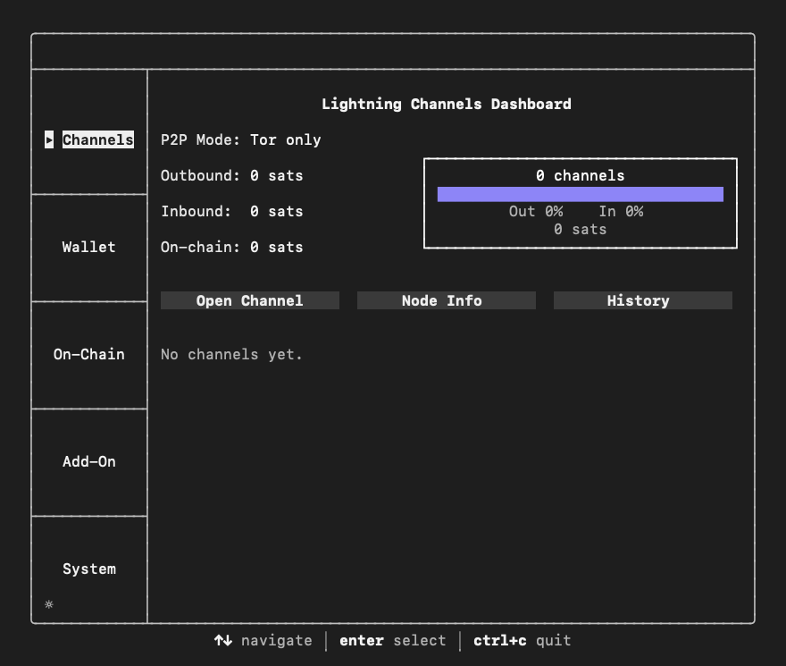
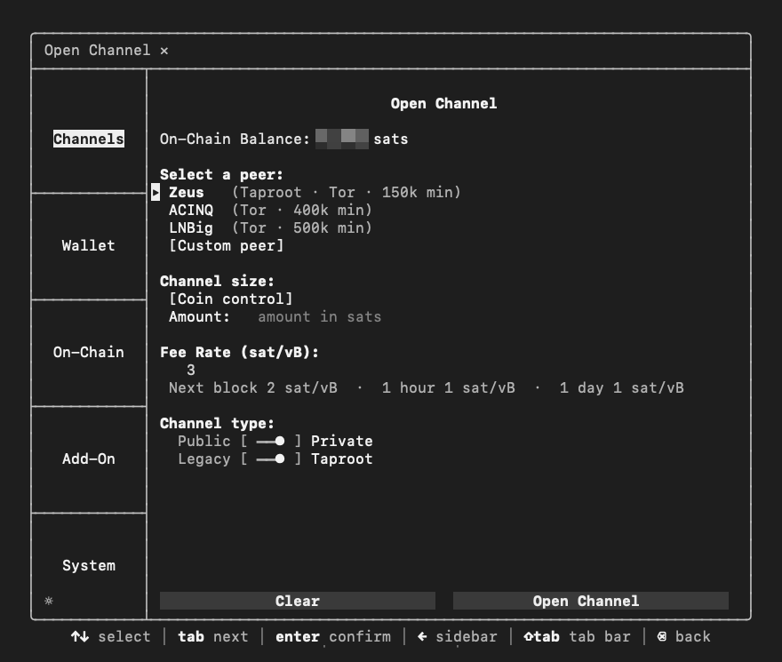
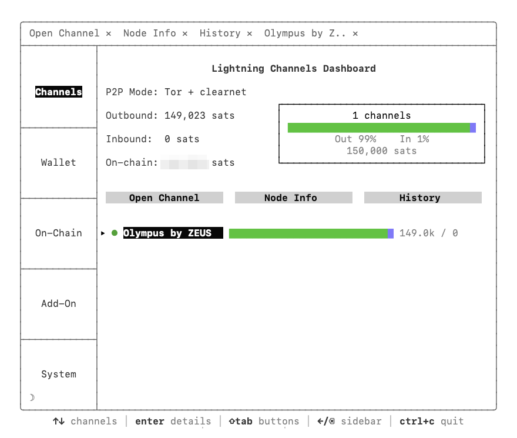
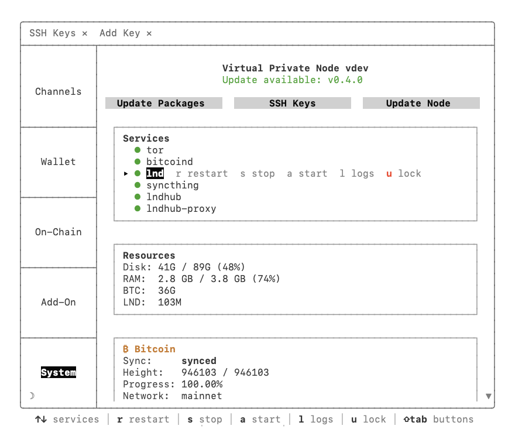

# Virtual Private Node

A Bitcoin + Lightning Node on Debian Linux.
Bitcoin Core, LND, and Tor, configured and running in minutes.

## Project status

**A new home, new name, and v0.7.0.**

Virtual Private Node moved to github.com/virtualprivatenode/vpn, and
the move brought every earlier release with it. Those releases predate
the rename: they install a binary called rlvpn, and they are the
previous generation of this project. v0.7.0 is the first release under
the new name and it is what this page describes.

If you are setting up a node now, it is worth waiting for v0.7.0.
v0.7.0 is fresh-install-only: it does not perform an in-place migration from an
existing `rlvpn` installation or an older unmarked `vpn` layout.

If you already run a node, nothing changes until you deliberately plan a move.
[MIGRATION.md](MIGRATION.md) explains the supported fresh-machine procedure and
why the v0.7.0 installer refuses pre-existing project state.

Please do not build and run the main branch on a node that holds
funds.

## Screenshots

<p>
  
  
</p>
<p>
  
  
</p>

## What gets installed

### Base (automatic)

- **Bitcoin Core** — pruned node, all P2P through Tor, GPG-verified with 5 independent signatures
- **LND** — Lightning Network daemon with Tor hidden services, installed Tor-only by default
- **Tor** — all traffic routed through Tor by default
- **UFW firewall** — deny all incoming except SSH
- **fail2ban** — brute force protection
- **Unattended upgrades** — automatic Debian security updates
- **NTP clock sync** — accurate time for block timestamps, HTLC timeouts, and macaroon expiry

### Optional (from the TUI)

- **Syncthing** — automatic LND channel backup to your local device

### Requirements

- Fresh Debian 13 amd64 machine
- 2 (v)CPU, 4+ GB RAM, 90+ GB total SSD. LND safety-stops at 10% free,
  leaving about 81 GB of operational usage on a 90 GB filesystem.

### Privacy

- **Private channels by default.** Channel funding transactions are not linked to your node in the public graph. SCID alias hides the real channel ID from route hints when supported by the channel peer. Blinded paths (default on) go further by eliminating route hints entirely.
- **Blinded paths on invoices (default on).** Invoices use encrypted route data instead of plain hop hints. Senders can pay you without learning your node's pubkey, channel partners, or channel funding UTXOs.
- **Coin control for channel opens.** You choose which UTXOs fund each channel. One UTXO in, one channel out. No silent coin consolidation linking your channels on-chain.
- **Taproot channels (default on).** Cooperative channel closes produce a MuSig2 key-path spend, which looks identical to a regular single-sig transaction on-chain. Requires peer support.
- **Consistent P2TR address type.** All addresses (receive, change, close delivery, sweep) use the same P2TR format: `bc1p` on mainnet and `tb1p` on the testing profiles. P2TR has a smaller anonymity set than P2WPKH today, but matching LND's internal address type prevents change-detection fingerprints that would link your outputs regardless of anonymity set size.
- **No node alias.** Your node appears in the network graph with only its pubkey. No identifying name broadcast.
- **Tor-only by default.** All LND connections route through Tor hidden services. Your server IP is never published to the Lightning Network unless you explicitly upgrade to hybrid P2P mode.

### What the installer does

The installer takes a transient whole-run lock, checks the environment, and
refuses with a full report before starting durable installation work if the box
is not one it can trust. It then walks you through access setup and hardware
fit, installs Bitcoin Core and LND with every download after Tor
routed through Tor and verified before install, and drops you
straight into the TUI. During interactive installation, Ctrl+C requests a stop
after the active step and its progress record finish; keep the terminal open
while it stops. The installer retains its lock until that work settles. This
does not kill an active subprocess or undo changes. If the last step finishes,
the installer still publishes completion. Forced process death can leave
unrecorded work that a later run must repeat.

If a step fails or installation stops, inspect the reported result before
running it again. When the installer can prove that it is resuming the same recognizable
fresh-install lifecycle, it continues from the incomplete work. A completed
base installation reports already installed and stops; optional add-ons and
later settings remain available through the TUI. Mainnet and testnet4 remain
supported. This unreleased candidate adds default public signet as the third
immutable profile described below; it is not release-certified until the exact
candidate passes the required disposable Debian 13 amd64 validation.

### Bitcoin network profiles

Mainnet remains the default. Testnet4 remains the public proof-of-work test
network. The default public-signet candidate is testing-only and uses Bitcoin
Core and LND's pinned built-in public-signet parameters; VPN does not override
its challenge or seed nodes. Generated configuration and unit tests alone do
not certify this profile; disposable Debian 13 amd64 operational evidence is
required before release support is claimed.

| VPN profile | Installer selector | Core/LND state directory | Address HRP | BOLT11 prefix |
| --- | --- | --- | --- | --- |
| `mainnet` | none (default) | `mainnet` conventions | `bc` | `lnbc` |
| `testnet4` | `--testnet4` | `testnet4` | `tb` | `lntb` |
| `public-signet` | `--signet` | `signet` | `tb` | `lntbs` |

(VPS)

```bash
# Default mainnet
sudo vpn install

# Public proof-of-work testnet4
sudo vpn install --testnet4

# Default public signet (testing only)
sudo vpn install --signet
```

The chosen profile is recorded before installation work begins and cannot be
changed. A node will not reuse another profile's Core data, LND wallet,
macaroons, channel state, lifecycle authorization, or channel-backup source.
Reusing the machine for another profile requires a new disposable machine;
there is no in-place profile migration or switch.

`controlled-signet-v1`, raw `signet`, custom challenges, and custom seed-node
inputs are rejected and unsupported. VPN also does not install a faucet,
explorer, miner, block signer, second Lightning node, or scenario controller.
Testing profiles remain visibly marked in the TUI, and their coins have no
mainnet value.

**Access setup.** The installer creates a `vpn` admin user and
shows every SSH key it finds on the box — with fingerprints and
comments, and provider control lines excluded — for you to
confirm, replace, or extend before they are copied. You also set
a login password (16 bytes minimum) as the provider console
fallback; whether password login over SSH stays enabled is
preserved exactly as the installer OBSERVED it on your box —
installing never silently changes it.

Password paste preserves spaces and accepts one trailing newline. Input that
would be altered or exceed the field's 128-character limit is rejected and
cleared, rather than silently changing the password.

### Wallet Creation

On first launch of the node TUI, you go straight to the wallet
creation flow:

1. Read the privacy and seed warnings, press Proceed
2. Wait for LND to become ready
3. Type a wallet password
4. Write down your 24-word seed on paper
5. Type `I SAVED MY SEED` to confirm

The confirmation phrase is required — there is no skip. Once confirmed,
the flow transitions into auto-unlock configuration so you don't have
to manually unlock on every reboot. VPN gracefully stops and starts LND
once to verify the password, and reports success only after LND reaches
its native `RPC_ACTIVE` state, or `SERVER_ACTIVE` if it advances between
checks. Network-profile validation remains an independent installer
responsibility, and password verification does not wait for blockchain
synchronization. If
verification fails, LND is left stably locked instead of entering a
restart loop, and the same form lets you retry.

A note on cancellation: pressing `ctrl+c` during the password prompt is
a legitimate escape hatch (no seed has been generated yet, nothing is
written to disk). Once you've seen your seed, `ctrl+c` is blocked by
design — the only way forward is typing the confirmation phrase.

### Dashboard

Every SSH login as `vpn` opens a terminal UI with a sidebar of
five sections plus a dark/light theme toggle:

- **Channels** — open channels with coin control; close and manage channels; view your Node Info (pubkey, URIs, QR codes for sharing); channel history
- **Wallet** — send and receive Lightning payments; payment history
- **On-Chain** — send and receive on-chain; UTXO coin control; transaction history with anchor sweep detection
- **Add-On** — install and manage Syncthing (channel backup)
- **System** — service status and logs; SSH key management and password auth toggle; auto-unlock configuration; P2P mode upgrade; self-update

Detail views open in tabs within each section. Press `ctrl+c` to quit
and drop to a shell:

```bash
bitcoin-cli getblockchaininfo
bitcoin-cli getpeerinfo

lncli getinfo
lncli walletbalance

# Services
systemctl status bitcoind
systemctl status tor@default
systemctl status lnd
systemctl status syncthing
```

### Connecting Zeus Wallet

Open the **Wallet** section in the TUI for Zeus pairing — scan a QR
code or copy the connection string. Both Tor and clearnet pairings
are supported if your node is in hybrid P2P mode.

#### Tor only (default)
1. Open the Wallet section → Pair Wallet
2. In Zeus: Advanced Set-Up → LND (REST)
3. Scan the QR code, or copy the server address, REST port (8080),
   and macaroon

#### Clearnet + Tor (hybrid mode)
1. Upgrade to hybrid P2P mode from System → P2P Upgrade
2. Open the Wallet section → Pair Wallet
3. Both clearnet (IP:8080) and Tor connection strings are available
4. First clearnet connection: accept the self-signed certificate
   warning — the connection is encrypted with LND's auto-refreshed
   TLS certificate

Note: Clearnet is faster. Tor is more private. Both use the same macaroon.

### Sharing Your Node

The **Channels** section has a **Node Info** tab that displays
everything a peer needs to open a channel with you:

- Node alias, pubkey, LND version
- Peer count, active channels, node capacity
- Outbound, inbound, on-chain, and total spendable balances
- QR codes for your advertised URIs (Tor, clearnet, or both)
- A `Copy URIs` button that drops to a shell view with clean
  clearnet/Tor section labels for easy copy-paste

### P2P Mode

LND is installed Tor-only by default. You can upgrade to hybrid mode
later from **System → Services → LND → P2P Upgrade**:

- **Tor only** — maximum privacy, all connections through Tor
- **Hybrid (Tor + clearnet)** — better routing, your server IP is
  published to the Lightning Network

The upgrade is one-way — once your IP is published to the network
gossip, it cannot be retracted.

### LND Database and Recovery

Fresh v0.7.0 installations use LND's local SQLite backend and native SQL
stores. VPN does not migrate an existing bbolt node, and the database settings
must not be changed after initialization. SQLite's WAL, checkpoint, locking,
and durability behavior remains at the pinned LND release's defaults.

LND checks disk space every 12 hours and makes two attempts before gracefully
stopping when filesystem free space reaches 10%. Because
`Restart=on-failure` does not restart that successful safety shutdown, free
space and then start LND explicitly. VPN does not delete, recreate, or repair
a database automatically.

The seed and `channel.backup` are the supported routine disaster-recovery
artifacts. An SCB does not restore live channels: it asks reachable peers to
force-close so settled funds can be swept on-chain. VPN does not synchronize
the SQLite databases or advertise a live database-copy procedure. See LND's
[operational safety](https://github.com/lightningnetwork/lnd/blob/master/docs/safety.md)
and [recovery](https://github.com/lightningnetwork/lnd/blob/master/docs/recovery.md)
guides before attempting a restore or whole-node move.

### Syncthing Channel Backups

Syncthing automatically syncs your LND `channel.backup` file to
your local device. No cloud services. No trust. If your Node dies, the
seed phrase and this file can recover settled channel funds through LND's
emergency channel-closure procedure.

The sync connection is direct between your Node and your device
over an encrypted channel. Syncthing uses mutual TLS authentication
with device keys — only devices you explicitly approve can connect.
Discovery servers, relays, and NAT traversal are disabled.

**Setup summary:**

1. Install Syncthing on your device from [syncthing.net](https://syncthing.net)
2. Disable discovery, relays, and NAT traversal in local Syncthing settings
3. Pair your device from the Add-On section in the dashboard
4. Add the Node as a remote device in your local Syncthing
5. Accept the backup folder share and set it to Receive Only

Your `channel.backup` syncs automatically whenever both devices are
online. The Syncthing web UI on the Node is accessible over Tor for
advanced configuration.

For the full setup guide, see
[Syncthing Setup Guide](docs/syncthing.md).

### Security

- TUI runs as the unprivileged `vpn` admin user, which has **no sudo rights at all**. Privileged operations (service control, updates, config changes) go through a socket-activated root helper that serves a fixed menu of typed operations — no arbitrary commands, no arbitrary file reads — verifies the identity of every connecting process, and logs every operation to the system journal, which the admin user can read but not rewrite
- All connections through Tor (SOCKS5 port 9050)
- IPv6 disabled to prevent Tor bypass
- Stream isolation (separate circuit per connection)
- UFW firewall: SSH only, on the port(s) sshd actually listens on (+ 9735, 8080 for hybrid P2P, 22000 for Syncthing)
- Fail2ban: SSH brute-force protection
- Root SSH disabled by the installer
- SSH hardening: challenge-response, keyboard-interactive, and X11 forwarding disabled; password auth carried over exactly as OBSERVED on your box at install (toggle from System → SSH Keys once you've verified key auth works); login password changeable from the TUI
- Bitcoin Core, LND, and Syncthing run as separate, non-login system users; `vpn` has no direct access to their private data directories
- Tor control-cookie access is granted only inside `bitcoind.service` and `lnd.service`; Syncthing and the backup exporter receive none
- VPN and LND authenticate to Bitcoin Core with separate `rpcauth` identities. Bitcoin Core RPC-cookie generation is disabled for fresh v0.7 installations, and neither client reads a Core cookie or data directory. Unsupported legacy layouts are refused rather than modified, so VPN does not delete their historical cookie files
- Channel backups cross through a dedicated `lnd` publisher into the project-owned `/var/lib/vpn/exports` boundary; Syncthing can read only the completed `channel.backup`, cannot write the export, and cannot read `/var/lib/lnd` or private staging
- GPG signature verification for all software, any bad signature is a hard stop
- Unattended security upgrades with auto-reboot
- Base packages upgraded during install — behind the firewall, which comes up first — to close CVE windows on stale server images
- Syncthing backup sync: mutual TLS device approval, web UI only via Tor
- Bitcoin Core wallet disabled
- All downloads and apt operations route through Tor once Tor is up (verified by a hard gate before any download)
- Atomic config writes with fsync + rename (prevents corruption on power loss)
- Secure temp file creation with O_EXCL (prevents symlink attacks)
- Public IP detection uses kernel routing table (no external network calls)
- Mandatory seed confirmation ("I SAVED MY SEED") during wallet creation
- Auto-unlock (optional) uses an `lnd:lnd` 0400 local password file, never sends the password over the network, and verifies a new LND invocation before publishing success

### Privacy — Network Traffic

Downloading the `vpn` binary and signing key is
ordinary clearnet traffic — Tor does not exist on the box yet.
After that, the installer makes two types of network calls:

**Phase 1 (clearnet, unavoidable):**
- `apt-get update` — Debian package index refresh
- one `apt-get install` — Tor, torsocks, ufw and base tools,
  from Debian package mirrors
- `apt-get upgrade` — Debian security updates (runs behind the
  freshly enabled firewall)
- NTP time sync enablement — ongoing clock sync queries to the
  Debian NTP pool (continues after install)

**Phase 2 (all through Tor, hard-gated):**
- Bitcoin Core and LND downloads
- Syncthing download (when Syncthing is installed)
- All subsequent apt operations

Before the first Phase-2 download, the installer verifies Tor
routing on Tor's own control port and refuses to continue if it
cannot confirm it — on every run, including resumes.

After install, the only ongoing clearnet traffic is NTP clock
sync (to the Debian NTP pool), Syncthing sync (port 22000) if
you install it, and LND P2P if you choose hybrid mode.
Everything else routes through Tor.

Verify Tor routing after install:
```bash
grep "Tor" /var/log/vpn.log
```

### Software Verification

All software is verified with GPG signatures and SHA256 checksums:

- **Bitcoin Core** — 5 trusted builder keys from
  [bitcoin-core/guix.sigs](https://github.com/bitcoin-core/guix.sigs).
  Requires 2 of 5 valid signatures. A bad signature (BADSIG) from any
  key is a hard stop.
- **LND** — Roasbeef's signing key verified against known fingerprint.
- **Syncthing** — pinned release binary, verified against the Syncthing
  release signing key's known fingerprint. The release checksums are
  clearsigned by the same key. The installer also writes Syncthing's
  entire configuration itself and refuses to start the daemon if any
  privacy setting does not verify.
- **vpn binary** — signed with a key hosted on an independent
  keyserver (not GitHub). You download and verify it yourself
  before running it (see [Release Verification](docs/verifying.md)),
  and the built-in updater performs the same key and checksum
  verification for every later release. Hosting the key off GitHub
  means compromising one source does not compromise both the
  binary and the key.

The release signing key fingerprint is
`AFA0 EBAC DC9A 4C4A A7B0  154A C97C E10F 170B A5FE`. The same key
has signed every release of this project and will sign v0.7.0.

Verification failure is a hard stop.

After installation, review the log:

```bash
cat /var/log/vpn.log
```

For manual binary verification before installation, see
[Release Verification](docs/verifying.md).

### Directory Layout

| Path | Contents |
| --- | --- |
| /etc/bitcoin/bitcoin.conf | Bitcoin Core configuration |
| /etc/lnd/lnd.conf | LND configuration |
| /etc/syncthing/ | Syncthing configuration |
| /etc/vpn/config.json | Root-owned, non-secret desired node configuration; root:vpn mode 0640 |
| /home/vpn/.config/vpn/preferences.json | User-owned TUI preferences (theme); vpn:vpn mode 0600 |
| /var/lib/vpn-install-bootstrap-service-layout-1-{mainnet,testnet4,public-signet}-tor | Short-lived root-only indication while initial lifecycle authority is published |
| /var/lib/vpn/private/layout-version | Root-only supported-layout generation record |
| /var/lib/vpn/private/install-state.json | Root-only bounded base-install progress and completion ledger |
| /var/lib/vpn/private/password-pending | Root-only interrupted unattended-password delivery marker, present only while needed |
| /var/lib/vpn/private/key-verification-pending | Root-only first-login verification marker, present only while needed |
| /run/vpn/install.lock | Stable root-only runtime lock for one active base installer |
| /var/lib/vpn/state/ | Root-written facts and credentials deliberately staged read-only for the TUI, including the Syncthing web password |
| /var/lib/vpn/exports/lnd-backup/ | Read-only Syncthing export of the completed `channel.backup` |
| /var/lib/bitcoin/ | Mainnet Core data at the root; testnet4 under `testnet4/`; public signet under `signet/` |
| /var/lib/lnd/data/chain/bitcoin/{mainnet,testnet4,signet}/ | Profile-specific wallet and macaroon state in `chain.sqlite`, plus credentials and `channel.backup`; `signet/` is default public signet only |
| /var/lib/lnd/data/graph/{mainnet,testnet4,signet}/ | Profile-specific channel/graph KV state in `channel.sqlite` and native invoice, payment, and graph state in `lnd.sqlite` |
| /var/lib/lnd/data/watchtower/bitcoin/{mainnet,testnet4,signet}/ | Profile-specific `watchtower.sqlite`; LND creates it even when the watchtower server is disabled |
| /var/lib/syncthing/ | Syncthing's private data |
| /var/log/vpn.log | Application log (install, verification, status) |

## License

Copyright (C) 2026 Virtual Private Node

This project is free software licensed under the
[GNU Affero General Public License v3.0](LICENSE).
